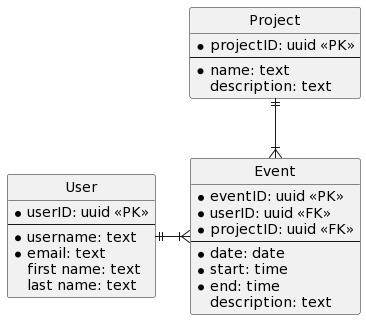
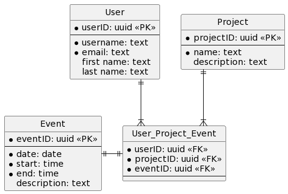

# TIME ENTRY SYSTEM BLOG

## 2023-02-13

Wow, rocky start today on this thing. I had made some major booboos with the SQLAlchemy models a few days ago that had to be cleaned up. But first, I ADDED DOCUMENTATION!

Yes, if you go to [this site](https://joseph-sayler.github.io/python_time_manager/index.html) (which is just a gh-pages site for this repo), you will see my lovely new documentation! It uses [mkdocs](https://www.mkdocs.org/) and the [material](https://squidfunk.github.io/mkdocs-material/) theme to make a very nice looking documentation page. And, it is all generated from my code!! I even set up a GitHub Action to handle generating it after I push commits. Super cool!!

Ok now for the SQLAlchemy models. I messed up. I did not know this, but type annotations on Relationships can really mess things up if you do not implement them right. I had used the generic Any to describe what model went with the relationship and it messed things up! It took me forever to figure it out too. I tried using the model (class name) but because of how I have the folder structure set up, I was getting partial import errors. So I just removed them! Problem solved! they aren't really necessary and I am not sure why I put them there to begin with.

Aside from that, I did some nice testing of the database schema and found that I really needed to set up a relationship between Event and User so that I can query a user for events to get only the events that user entered. And Project is already set up to link with Event so now I can check the project an event goes to very easily. And because i used ```back_populates```, I have access to all this info from either direction -  User -> Event, Event -> User, or Project -> Event, Event -> Project.

I think next I should tackle unit tests, but I have to set up the ```update``` method for the database engine...

## 2023-02-02

Alright back at it after several weeks of break!

I have taken the models made last time and put them into the models folder in the projects folder, in a tables.py file. I have successfully added and queried the data in the sqlite database. This is looking good!

Now that the basics are set up, I can start creating my CRUD engine (hehe). This will hold the basic <b>C</b>reate, <b>R</b>ead, <b>U</b>pdate, and <b>D</b>elete wrapper commands to be used by rest of application. I am going to start out small and build up as I need to. I have created a folder called 'crud' and each action is a separate file, so there is a ```create.py```, ```read.py```, ```update.py```, and ```delete.py```. I figure this is good enough until I develop a better picture of what this will turn into. Each file contains a function that handles the basic operation. More than likely this will change as time goes on.

So far running into challenges with session object and getting VSCode to recognize imports. May need to turn pylint off since it is really throwing a lot of errors! I will continue to work on this and see how far I get ....

## 2023-01-18

Ok, I have made a decision on the data base schema. I did some more web searching and found a near perfect example [here](https://stackoverflow.com/a/65984044) of what I am looking for. This answer basically states what I initially thought at the begining of yesterday's ponderings.

So my new database schema will be as follows:



How to describe this?: one ```User``` can have many ```Events```, and one ```Project``` can have many ```Events```, but one Event only has one User and one ```Project```.

Based on this description, I think the UML image describes what I want. The "only one ```User``` and ```Project```" might have to be enforced via the ORM though. I think intrinsicly this schema will impose that, which is why I am leaning towards it. So **now** I can move on to the ORM...

## 2023-01-17

### Idea for SQL tables

The idea is to have a set of tables representing the data and their relationships. There will be three tables total: ```User```, ```Project```, and ```Event```.

- ```User``` represents a person using the application.
- ```Project``` represents something being worked on (a, uh, project?). 
- ```Event``` is the start/stop time user spent working on project.

#### Project Tables

Each table should have the following fields:

|  **User**  |     **Project**     |  **Event**  |
| :--------: | :-----------------: | :---------: |
|  user id   |     project id      |  event id   |
|  username  |    project name     |    date     |
|   email    | project description | start time  |
| first name |                     |  end time   |
| last name  |                     | description |

The above does not include cross linking IDs between tables. I was thinking of linking the tables as follows

#### Relationship between tables

- User has a one to many relationship with Event
    - one user can create multiple events
- Project has a one to many relationship with Event
    - one project has many events
- Event has a one to one relationship with Project
    - one event can only belong to one project
  - Event has a one to one relationship with User
    - one event can only be created by one user
- User has a many to many relationship with Project
    - one user can be in many projects, and one project can have many users
    - but no one unique user can be in the same unique project twice:interrobang:

Example of User relationship to Project:
- Project 1 -- Users: UserA, UserB, UserC
- Project 2 -- Users: UserA, UserC
- Project 3 -- Users: UserB, UserC, UserD, UserE
- Project 4 -- Users: {{EMPTY}}

User A cannot be in Project1 twice, so one user per many projects, but Project1 can have many users other than User A...

But UserA can be in Project 2 at the same time as Project 1. Also, UserC can be in the same projects (or more) as UserA. Also a project could have NO users. So what is relationship between User and Project?

This would mean that I can have many users assigned to many projects and many projects can have many users. So this is a Many to Many relationship. That means we need a intermediary table, or an **association table**. By creating a 4th table that only has the primary keys of the other 2, we can link everything up without duplication :sunglasses:

Despite the above, now I am questioning the Event table. I want the event table to be linked to the user that creates it, but also to be a part of a project. I guess one could have events without projects, but that seems silly to me. So do i keep projects as a separate table or do I include it with events? Because I definately want a user to be tied to an event. But it still holds that one event can only have 1 user and 1 project associated with it. So that would make Event table 1-to-1 with User table and 1-to-1 with Project table. It almost seems like Event table could be used as an association table, doesn't it?

Lets look at it again: UserA is in Project1 with users UserB and UserC. UserA is also in Project2 with UserB and UserD. UserA does work on Project1, creating an event for Project1. UserA later works on Project2, creating a separate event for Project2. So we have event UserA-Project1 and UserA-Project2. UserB does the same thing, now adding in UserB-Project1 and UserB-Project2. UserC and UserD do same for their projects, giving us UserC-Project1 and UserD-Project2. Now look at what we got:

- UserA-Project1
- UserA-Project2
- UserB-Project1
- UserB-Project2
- UserC-Project1
- UserD-Project2

By way of our associative table, we cannot have any user in any project more than once. So would it be safe to say that there is no way to create an event that might do the same? Yes, I think this is true.

Now, in looking up events, would I really need to look at an associative table to get this information? No, I could go straight to the Event table. So why not have Event contain an event id and its related data, like how the other two tables are, and create one large associative table for all 3?

So now our database schema would then look something like this:



This is a ternary relationship. Here, a user is linked to many projects, and can link to a single event. Also, a single project can link to many users and their individual events. But a project will only have events related to it. So from the project perspective, you can look at events from all users or events of a specific user, in that project. When you look at events from the user perspective, you can see all the events for all the projects they worked on, or events limited to a specific project.

I think this will work and adequately describes my idea of how these three components interact. Event is a 1:1:1 with User and Project, User is a 1:M:M in regards to Event and Project, and so is Project (1:M:M) in regards to User and Event.

Now, how to model this using an ORM:interrobang:

## 2023-01-16

Because this app will take user input, I want to use pydantic to validate that input. But I will also be storing data in a data base, so SQLAlchemy would also be required (I could use some other ORM, but SQLAlchemy has a lot going for it). I have been looking for a way to combine models created by these two libraries, but there really isn't much out there. There is [ormar](https://github.com/collerek/ormar), but I feel it is geared towards [FastAPI](https://fastapi.tiangolo.com/) and Async programming, neither of which I plan on using (right now!).

I did some poking around the internet, found [this Reddit post from a few years ago](https://www.reddit.com/r/FastAPI/comments/lmywl6/comment/gnzdno1/?utm_source=share&utm_medium=web2x&context=3), and it seems to explain things nicely, even if oriented towards FastAPI. So I think I will bite the bullet and just make models for each. I can use the ```from_orm()``` function to pop data from ORM to Pydantic, which is nice. Not sure if it goes the other way (probably?). But I will figure that out later. For now it should be enough to come up with a schema of data entry and database schema to hold me over...
